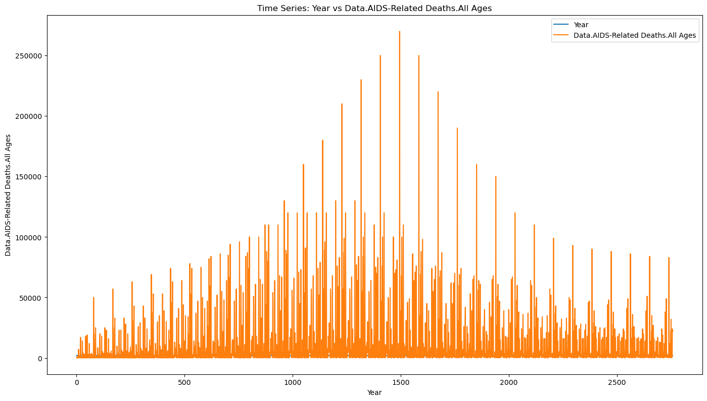
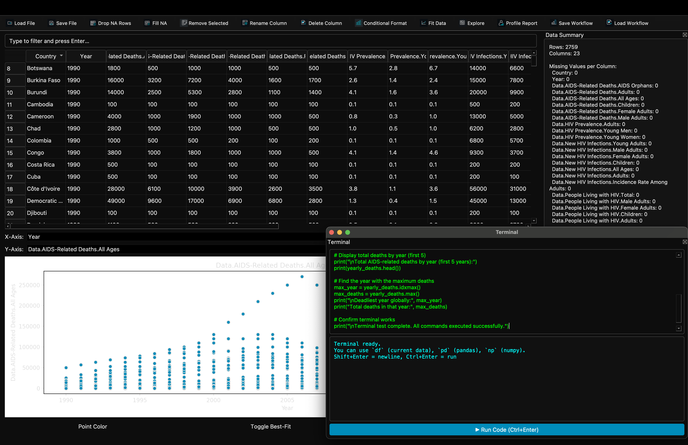

# DataSpec – Bayesian Data Analysis Toolkit

**DataSpec** is an open-source Python desktop application for scientific data analysis, Bayesian modeling, and nonlinear curve fitting. It provides researchers and students with an intuitive PyQt5 GUI to perform advanced statistical workflows — including Poisson modeling, MCMC inference, and data profiling — without writing any code.

---

## 🚀 Key Features

- 📊 **Bayesian Regression**: Fit Gaussian, Voigt, and Poisson models with posterior sampling using PyMC3  
- 🧠 **MCMC Inference**: Explore parameter uncertainty with NUTS and Metropolis-Hastings samplers  
- 🧪 **Nonlinear Curve Fitting**: Supports peak analysis for experimental data (e.g., nuclear spectroscopy)  
- 📈 **Uncertainty Visualization**: Automatically plots best-fit curves, confidence intervals, and residuals  
- 🧹 **Data Profiling**: Generates detailed HTML reports (via ydata-profiling) for exploratory analysis  
- 🧰 **PyQt5 Interface**: Clean GUI supports drag-and-drop CSV input, interactive selection, and session feedback  

---

## 📂 Project Contents

```
DataSpec-App/
├── DataSpec.py             # Main application script (PyQt5 GUI)
├── profile.html            # Example data profiling report
├── requirements.txt        # All Python dependencies
├── .gitignore              # Exclusions for cleaner version control
├── README.md               # You're reading it!
├── 1.png - 7.png           # Output plots and UI screenshots
```

---

## ⚡ Quick Start

### Run the App
```bash
python DataSpec.py
```
> Requires Python 3.8+ and dependencies listed in `requirements.txt`. Use the GUI to load your data, select a model, and run fits.

---

## 📦 Installation

### 1. Clone the repo
```bash
git clone https://github.com/yourusername/DataSpec-App.git
cd DataSpec-App
```

### 2. (Optional) Create a virtual environment
```bash
python -m venv venv
source venv/bin/activate  # On Windows: venv\Scripts\activate
```

### 3. Install required packages
```bash
pip install -r requirements.txt
```

---

## 🔧 Dependencies

Dependencies are listed in `requirements.txt`. Key packages include:

```
numpy>=1.22.0
pandas>=1.4.0
matplotlib>=3.5.0
seaborn>=0.11.2
scipy>=1.8.0
pyqt5>=5.15.7
pymc3>=3.11
arviz>=0.11.0
theano-pymc>=1.1.2
ydata-profiling>=4.4.0
```

---

## 📸 Screenshots

### 📈 Voigt Curve Fit


### 🔥 Residual Heatmap


---

## 📑 Example Output

This repository includes a working HTML profiling report generated with `ydata-profiling`.  
You can open [`profile.html`](./profile.html) in any browser to view:

- Column-level statistics
- Histograms and correlation heatmaps
- Null value counts and outlier warnings
- Interactions and variable summaries

---

## 📄 License

MIT License — free to use, modify, and redistribute with attribution.

---

## 👤 Author

**Axel Fraud**  
Physics + Data Science @ NC State  
[LinkedIn](https://www.linkedin.com/in/axel-fraud) • [dataspec.org](https://dataspec.org)
